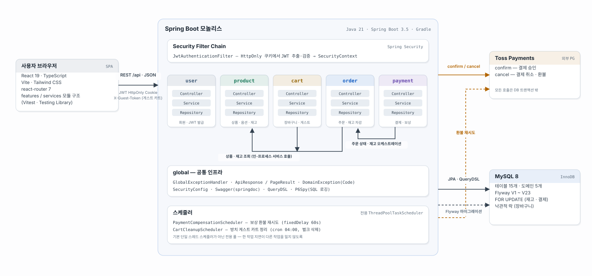
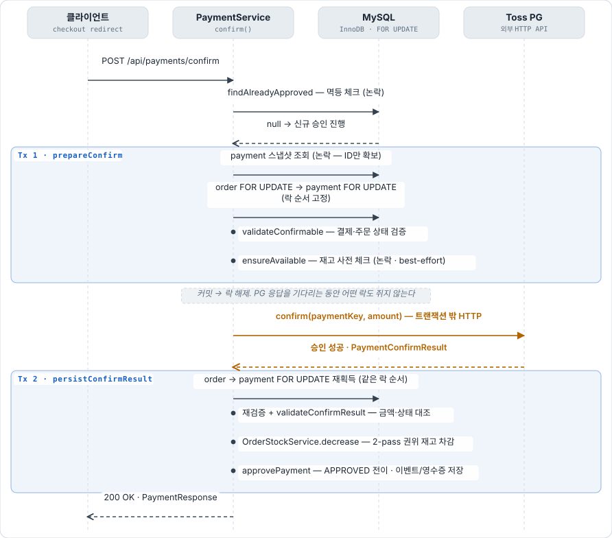

# commerce

재고·결제 정합성에 집중한 커머스 플랫폼. Spring Boot 모놀리스 + React SPA로,
**회원가입 → 상품(옵션 조합) 탐색 → 장바구니(회원/게스트) → 주문 → Toss 결제 승인/취소 → 재고 차감/복원**의 전체 흐름이 동작한다.

CRUD를 넓게 펼치는 대신, **"돈과 재고가 어긋나지 않게"** 라는 한 가지 문제를 깊게 팠다 —
동시성 제어(락 순서·2-pass 차감), 트랜잭션 경계 분리, 보상 트랜잭션과 재시도 큐가 이 프로젝트의 중심이다.

## 기술 스택

| 영역 | 스택 |
|---|---|
| Backend | Java 21 · Spring Boot 3.5 · Spring Security (JWT) · JPA + QueryDSL · Flyway |
| Database | MySQL 8 (InnoDB) — 테이블 15개, 마이그레이션 V1~V23 |
| Frontend | React 19 · TypeScript · Vite · Tailwind CSS · react-router 7 |
| 기타 | Toss Payments 연동 · springdoc(Swagger) · P6Spy · Vitest / JUnit 5 |

## 아키텍처



모놀리스지만 도메인 경계(user · product · cart · order · payment)를 패키지로 강제하고,
도메인 간 통신을 Service 인터페이스 호출로 제한했다. 재고 차감 + 주문 상태 + 결제 승인이
하나의 로컬 트랜잭션으로 묶여야 하는 도메인 특성상, 분산 환경의 복잡성 대신 트랜잭션 정합성을 택했다.
→ 상세: [docs/architecture.md](docs/architecture.md)

## 핵심 기술 결정

### 1. 결제 승인 — 트랜잭션 3분할과 보상 환불

**문제** — PG(외부 HTTP) 호출을 DB 트랜잭션 안에서 하면, PG 응답 지연 시간만큼 커넥션과
`FOR UPDATE` 락을 쥐게 된다. PG 장애가 곧 DB 장애가 되는 구조.

**해결** — 승인 흐름을 `짧은 Tx 1(사전 검증) → 트랜잭션 밖 PG 승인 → 짧은 Tx 2(재검증 + 권위 있는 재고 차감 + 승인 확정)`으로 분할했다.



PG 승인은 성공했는데 로컬 검증/재고가 실패하는 경우(돈은 잡혔는데 시스템은 실패)는
**보상 환불**로 풀고, 환불마저 실패하면 `payment_compensations` 테이블에 적재해
스케줄러가 백오프 재시도 → 초과 시 운영자 알림(GAVE_UP)으로 넘긴다.
→ 실패 경로 포함 시퀀스 4장: [docs/payment-flow-diagrams.md](docs/payment-flow-diagrams.md)

### 2. 재고 동시성 — 락 순서 고정 + 2-pass 차감

**문제** — 여러 주문이 같은 상품들을 다른 순서로 잠그면 데드락. 그리고 호출자가 예외를
catch하고 트랜잭션을 커밋하는 구조라, 차감 도중 실패하면 앞 아이템만 차감된 채 커밋될 수 있다(팬텀 재고 손실).

**해결** — 모든 재고 접근을 `productId → optionCombinationId` 정렬 순서로 잠가 순환 대기를
차단하고(`OrderStockService`), 차감은 **전체 검증을 먼저 끝낸 뒤 일괄 실행하는 2-pass**로
만들어 부분 차감 자체가 불가능하게 했다. 경합 특성에 따라 락도 다르게 골랐다 —
재고는 비관적 락(핫 로우), 장바구니는 낙관적 락(version, 사용자당 경합 없음).

### 3. 인증 — JWT를 HttpOnly 쿠키로

**문제** — localStorage 등 JS가 읽을 수 있는 곳의 토큰은 XSS 한 번에 탈취된다.

**해결** — JWT를 HttpOnly 쿠키로 전환해 스크립트 접근을 차단했다(PR #28, #29).
JWT 시크릿은 환경변수 미주입 시 기동 실패하는 fail-closed 설정. 게스트 장바구니는
`X-Guest-Token` 헤더로 분리하고, 방치된 게스트 카트는 스케줄러가 정리한다.

### 그 밖의 설계 포인트

- **주문당 결제 1건**을 DB 유니크(`payments.order_id UQ`)로 강제 — 중복 결제 원천 차단
- **회원별 주문 순번**(`user_order_no`) — 전역 PK 노출 대신 회원마다 1, 2, 3…, 동시 생성은 복합 유니크로 방어
- **주문 스냅샷** — 상품명·가격을 주문 시점 값으로 비정규화, 이후 상품이 바뀌어도 주문 내역 보존
- **결제 감사 테이블군** — 이벤트·취소·영수증·보상을 분리, PG 요청/응답 원문 보존

## ERD


실선은 FK 제약, 점선은 논리 참조 — 결제 테이블군은 의도적으로 FK 없이 인덱스와
애플리케이션 트랜잭션 경계로 정합성을 관리한다. 

## 실행 방법

### 요구사항

- Java 21, Node.js 20+, MySQL 8

### 1. 데이터베이스

```sql
-- 기본 설정 기준: localhost:3307, root/root
CREATE DATABASE commerce_practice;
```

접속 정보가 다르면 `DB_URL` / `DB_USERNAME` / `DB_PASSWORD` 환경변수로 재정의한다.
스키마는 애플리케이션 기동 시 Flyway가 자동 마이그레이션(V1~V23).

### 2. 백엔드 (:8080)

```bash
export JWT_SECRET='32바이트-이상의-시크릿-키를-넣는다-0123456789'  # 필수 — 없으면 기동 실패
export TOSS_SECRET_KEY='test_sk_...'                              # Toss 개발자센터 테스트 키

./gradlew bootRun
```

### 3. 프론트엔드 (:5173)

```bash
cd frontend
npm install
npm run dev   # /api → localhost:8080 프록시
```

### 4. API 문서

기동 후 Swagger UI: http://localhost:8080/swagger-ui.html

## 테스트

```bash
./gradlew test          # 백엔드 — 결제 서비스(승인/취소/보상), 재고, 인증 필터, 인가 등
cd frontend && npm test # 프론트엔드 — Vitest + Testing Library
```

## 프로젝트 구조

```
commerce
├── src/main/java/com/gieun/commerce
│    ├── domain/          user · product · cart · order · payment
│    │    └── */          controller · service · repository · entity · dto
│    └── global/          security(JWT) · exception · response · config
├── src/main/resources/db/migration/   Flyway V1~V23
├── frontend/             React 19 SPA (features/services 구조)
└── docs/                 설계 문서 · 다이어그램 (아래)
```
